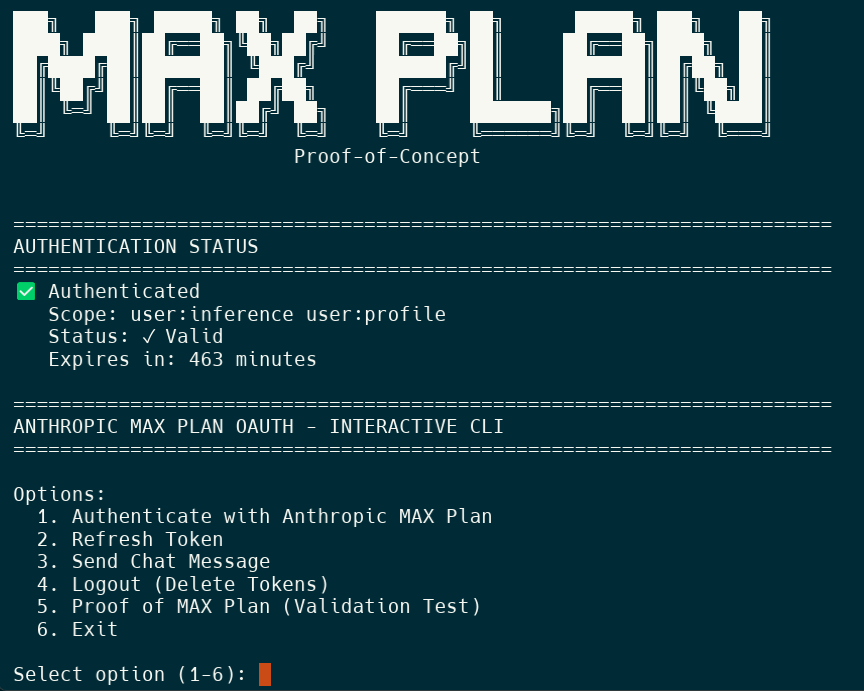

# Anthropic MAX Plan Router - Dual API Endpoints

<div align="center">



*Use your Anthropic MAX Plan with ANY AI tool - Anthropic SDK, OpenAI SDK, LangChain, and more!*

**Dual endpoints:** Native Anthropic API + OpenAI-compatible API (auto-translates to Anthropic)

[](https://www.npmjs.com/package/anthropic-max-router)
[](https://www.npmjs.com/package/anthropic-max-router)
[](https://opensource.org/licenses/MIT)
[](https://www.typescriptlang.org/)
[](https://nodejs.org/)
[](https://github.com/nsxdavid/anthropic-max-router)
[](https://github.com/nsxdavid/anthropic-max-router)
[](https://github.com/nsxdavid/anthropic-max-router)

</div>

---

## 📑 Quick Navigation

- [🌟 What Makes This Special?](#-what-makes-this-special)
- [⚡ Quick Start](#-quick-start---run-without-installing)
- [🚀 API Router](#-api-router)
- [🔧 Interactive CLI](#-interactive-cli)
- [📚 Implementation Guide](#-implementation-guide)
- [🧪 Testing](TESTING.md)

---

## 🌟 What Makes This Special?

This router gives you **dual API endpoints** - use your MAX Plan with tools built for **either** Anthropic or OpenAI!

| Endpoint | Format | Use With |
|----------|--------|----------|
| `/v1/messages` | Anthropic native | Anthropic SDK, Claude-specific tools |
| `/v1/chat/completions` | OpenAI compatible | OpenAI SDK, LangChain, LiteLLM, ChatGPT tools, any GPT-4 compatible tool |

**One router. Two APIs. Unlimited compatibility.** 🚀

---

## 🎯 Three Things in This Repository

### 🔧 **1. Interactive CLI** - Testing & Learning
A menu-driven tool to test OAuth flows, understand authentication, and experiment with API requests.
```bash
npm start
```

### 🚀 **2. API Router** - Production Ready
A standalone HTTP proxy with **both Anthropic and OpenAI endpoints** that lets ANY AI tool use your MAX Plan subscription via `http://localhost:3000`.

**Works with:** Anthropic SDK, OpenAI SDK, LangChain, LiteLLM, and any tool that supports custom base URLs!

```bash
npx anthropic-max-router
```

### 📚 **3. Implementation Guide** - Complete Documentation
Full technical documentation: OAuth PKCE flow, system prompt validation, token management, and API patterns.

[See ANTHROPIC-MAX-PLAN-IMPLEMENTATION-GUIDE.md](./ANTHROPIC-MAX-PLAN-IMPLEMENTATION-GUIDE.md)

---

## About This Repository

This repository provides **both practical tools and complete documentation** for using Anthropic's Claude MAX subscription plans with your own code.

**Why MAX Plan?** Flat-rate billing instead of pay-per-token. Perfect for high-volume AI development.

**Why This Router?** Use your MAX Plan with **ANY AI tool** - whether it's built for Anthropic's API or OpenAI's API. Both endpoints included!

**Special thanks to [OpenCode](https://github.com/sst/opencode)** - studying its OAuth implementation made this project possible.

---

> **⚠️ EDUCATIONAL AND RESEARCH PURPOSES**
>
> This project is provided for educational, research, and entertainment purposes only. It is not affiliated with, endorsed by, or sponsored by Anthropic PBC. Use of this software is at your own risk. The authors and contributors make no warranties and accept no liability for any damages or issues arising from use of this code. Users are responsible for ensuring their use complies with Anthropic's Terms of Service and all applicable laws. This software is provided "as-is" without any express or implied warranties.

---

## Requirements

- **Claude MAX Subscription** from [claude.ai](https://claude.ai) - $100/month or $200/month plan
- **Node.js** 18+

---

## ⚡ Quick Start - Run Without Installing

**The fastest way to get started** - no git clone, no npm install needed:

```bash
npx anthropic-max-router
```

That's it! The router will:
1. Automatically authenticate you via OAuth (first run only)
2. Start the proxy server on http://localhost:3000 with **both Anthropic and OpenAI endpoints**
3. Let you use MAX Plan billing from **any tool** - whether it uses Anthropic or OpenAI format!

### With Options

```bash
npx anthropic-max-router --help              # Show all options
npx anthropic-max-router --port 8080         # Custom port
npx anthropic-max-router --verbose           # Full request logging
npx anthropic-max-router -p 8080 --minimal   # Combine options
```

### Alternative Methods

<details>
<summary><b>Option 2: Run from GitHub (Latest Dev Version)</b></summary>

```bash
# Run directly from GitHub repository
npx github:nsxdavid/anthropic-max-router

# With options
npx github:nsxdavid/anthropic-max-router --port 8080 --verbose
```
</details>

<details>
<summary><b>Option 3: Clone and Run (For Development)</b></summary>

```bash
# Clone the repository
git clone https://github.com/nsxdavid/anthropic-max-router
cd anthropic-max-router
npm install

# Run the router
npm run router

# OR run the interactive CLI
npm start
```
</details>

---

## 🔧 Interactive CLI

A menu-driven application for testing, learning, and debugging OAuth flows.

### Features
- 🔐 OAuth authentication with step-by-step guidance
- 🔄 Manual token refresh testing
- 💬 Interactive chat mode with Claude
- 🗑️ Token logout/management
- ✅ MAX Plan validation proof test

### Usage

```bash
npm start
```

You'll see an interactive menu:
```
╔════════════════════════════════════════════════════════════╗
║   Anthropic MAX Plan OAuth CLI                             ║
╚════════════════════════════════════════════════════════════╝

1. Authenticate (OAuth flow)
2. Refresh access token
3. Send a chat message
4. Logout (delete tokens)
5. Proof of MAX Plan validation
6. Exit
```

### When to Use the CLI
- 🧪 Testing OAuth flows
- 📖 Learning how authentication works
- 🐛 Debugging API requests
- 🔍 Understanding MAX Plan validation
- 📝 Experimenting with system prompts

### CLI Source Files
```
src/
├── cli.ts           # Interactive menu
├── oauth.ts         # OAuth PKCE flow
├── client.ts        # API client with validation
├── token-manager.ts # Token storage/refresh
└── types.ts         # TypeScript definitions
```

---

## 🚀 API Router

A standalone HTTP proxy server with **dual API endpoints** (Anthropic + OpenAI) that lets **any AI tool or application** use your MAX Plan subscription.

**Supports both API formats:**
- `/v1/messages` - Native Anthropic Messages API
- `/v1/chat/completions` - OpenAI Chat Completions API (auto-translates to Anthropic)

Works with tools built for either Anthropic or OpenAI - just point them to `http://localhost:3000`!

### How It Works

```
┌─────────────────────┐
│   Your AI Tool      │
│   (any application) │
└──────────┬──────────┘
           │ http://localhost:3000
           ▼
┌─────────────────────────────────────┐
│  Router (This Application)          │
│  ├─ OAuth authentication            │
│  ├─ System prompt injection         │
│  ├─ Token auto-refresh              │
│  └─ Request logging                 │
└──────────┬──────────────────────────┘
           │ Authenticated requests
           ▼
┌─────────────────────┐
│  Anthropic MAX API  │
│  (Flat-rate billing)│
└─────────────────────┘
```

### Features
- ✅ **Dual API endpoints** - Anthropic native + OpenAI compatible
- ✅ **Universal compatibility** - Works with Anthropic SDK, OpenAI SDK, LangChain, LiteLLM, and more
- ✅ **Automatic translation** - OpenAI requests seamlessly converted to Anthropic format
- ✅ **Smart model mapping** - gpt-4, gpt-5, o1, etc. auto-mapped to Claude models
- ✅ Automatic OAuth authentication on first run
- ✅ Transparent system prompt injection (required by Anthropic)
- ✅ Token auto-refresh (8-hour expiration handled automatically)
- ✅ Configurable logging levels

### Basic Usage

```bash
# Start router (default: port 3000, medium verbosity)
npm run router

# With options
npm run router -- --port 8080              # Custom port
npm run router -- --verbose                # Full request/response logging
npm run router -- --minimal                # One line per request
npm run router -- --quiet                  # No request logging
npm run router -- -p 8080 --verbose        # Combine options
```

**First run:** Router prompts you to authenticate via OAuth. Follow the instructions.

**Subsequent runs:** Router starts immediately and auto-refreshes tokens.

### Command Line Options

| Option | Short | Description |
|--------|-------|-------------|
| `--help` | `-h` | Show help message |
| `--version` | `-v` | Show version number |
| `--port PORT` | `-p` | Set port (default: 3000) |
| **Endpoint Control** | | |
| `--enable-anthropic` | | Enable Anthropic /v1/messages endpoint (default: enabled) |
| `--disable-anthropic` | | Disable Anthropic endpoint |
| `--enable-openai` | | Enable OpenAI /v1/chat/completions endpoint (default: enabled) |
| `--disable-openai` | | Disable OpenAI endpoint |
| `--enable-all-endpoints` | | Enable both Anthropic and OpenAI endpoints (same as default) |
| **Verbosity** | | |
| `--quiet` | `-q` | No request logging |
| `--minimal` | `-m` | One line per request |
| (default) | | Medium verbosity - summary per request |
| `--verbose` | `-V` | Full request/response bodies |

**Environment variables:**
- `ROUTER_PORT=8080` - Set port
- `ANTHROPIC_DEFAULT_MODEL=claude-haiku-4-5` - Override model mapping for OpenAI requests

### Verbosity Examples

**Minimal** (`-m`) - One line per request:
```
[10:30:45] ✓ 200 claude-sonnet-4-5 (in:28 out:19)
[10:31:12] ✓ 200 claude-sonnet-4-5 (in:300 out:500)
```

**Medium** (default) - Request summary:
```
[2025-11-02T10:30:45.123Z] [abc123] Incoming request
  Model: claude-sonnet-4-5
  Max tokens: 1000
  ✓ Injected required system prompt
  ✓ OAuth token validated
  → Forwarding to Anthropic API...
  ✓ Success (200)
  Tokens: input=28, output=19
```

**Verbose** (`-V`) - Full JSON request/response bodies for debugging.

**Quiet** (`-q`) - No request logging (only startup messages and errors).

### Router API Endpoints

The router exposes **both Anthropic and OpenAI endpoints** by default:

#### **`POST /v1/messages`** - Anthropic Messages API
Native Anthropic format. Use with Anthropic SDK or any Anthropic-compatible tool.

```bash
curl -X POST http://localhost:3000/v1/messages \
  -H "Content-Type: application/json" \
  -d '{"model":"claude-sonnet-4-5","max_tokens":100,"messages":[{"role":"user","content":"Hello"}]}'
```

#### **`POST /v1/chat/completions`** - OpenAI Chat Completions API
OpenAI-compatible format with automatic translation to Anthropic. Use with OpenAI SDK, LangChain, LiteLLM, etc.

```bash
curl -X POST http://localhost:3000/v1/chat/completions \
  -H "Content-Type: application/json" \
  -d '{"model":"gpt-4","messages":[{"role":"user","content":"Hello"}]}'
```

#### **`GET /health`** - Health check
```bash
curl http://localhost:3000/health
# Returns: {"status":"ok","service":"anthropic-max-plan-router"}
```

### OpenAI API Compatibility

The router supports the OpenAI Chat Completions API format, enabling **zero-code integration** with tools built for OpenAI.

**Quick Comparison:**

| What You Have | What You Get | How |
|---------------|--------------|-----|
| Tool built for Anthropic | Use native Anthropic endpoint | Point to `http://localhost:3000` |
| Tool built for OpenAI | Use OpenAI-compatible endpoint | Point to `http://localhost:3000` |
| Both types of tools | Use both simultaneously! | Both endpoints work at the same time |

#### Why OpenAI Compatibility?

Many AI tools and libraries (Python OpenAI SDK, LangChain, etc.) are built exclusively for OpenAI's API format. With the OpenAI-compatible endpoint, these tools can use your MAX Plan subscription without any code changes - just point them to `http://localhost:3000`.

#### Using OpenAI Compatibility

Both endpoints are enabled by default! Just start the router:

```bash
npm run router
# or
npx anthropic-max-router
```

You can disable endpoints if needed:
```bash
# Disable OpenAI endpoint (Anthropic only)
npm run router -- --disable-openai

# Disable Anthropic endpoint (OpenAI only)
npm run router -- --disable-anthropic
```

When enabled, the router logs which endpoint each request uses:
```
[10:30:45] [OpenAI] ✓ 200 claude-sonnet-4-5 (in:28 out:19)
[10:31:12] [Anthropic] ✓ 200 claude-sonnet-4-5 (in:300 out:500)
```

#### How It Works

```
┌─────────────────────────┐
│  OpenAI-compatible Tool │
│  (Python SDK, etc.)     │
└───────────┬─────────────┘
            │ POST /v1/chat/completions
            │ OpenAI format request
            ▼
┌──────────────────────────────────────────┐
│  Router (Translation Layer)              │
│  1. Validate OpenAI request              │
│  2. Translate OpenAI → Anthropic format  │
│  3. Map model names (gpt-4 → claude)     │
│  4. Inject system prompt                 │
│  5. Forward to Anthropic API             │
│  6. Translate Anthropic → OpenAI response│
└───────────┬──────────────────────────────┘
            │ Anthropic Messages API
            ▼
┌──────────────────────────┐
│  Anthropic MAX API       │
│  (Flat-rate billing)     │
└──────────────────────────┘
```

#### Model Mapping

The router automatically maps OpenAI model names to Claude models using pattern-based detection:

| OpenAI Model Pattern | Maps To | Reason |
|---------------------|---------|--------|
| `gpt-3.5-*`, `gpt-3-*`, `*-nano` | `claude-haiku-4-5` | Low-tier/fast models |
| `gpt-4`, `gpt-5`, `gpt-6`, `o1`, `o3`, `o4`, etc. | `claude-sonnet-4-5` | All other models (best for MAX Plan) |

**Examples:**
```
gpt-4                → claude-sonnet-4-5
gpt-4o               → claude-sonnet-4-5
gpt-5.1              → claude-sonnet-4-5
o1-mini              → claude-sonnet-4-5
o3-pro               → claude-sonnet-4-5
gpt-3.5-turbo        → claude-haiku-4-5
gpt-5-nano           → claude-haiku-4-5
```

**Custom Mappings:**

Override specific models using `.router-mappings.json`:
```json
{
  "gpt-5-experimental": "claude-sonnet-4",
  "my-custom-model": "claude-haiku-4-5"
}
```

Or override all mappings with an environment variable:
```bash
ANTHROPIC_DEFAULT_MODEL=claude-haiku-4-5 npm run router -- --enable-openai
```

#### OpenAI Usage Examples

**Python (OpenAI SDK):**
```python
from openai import OpenAI

client = OpenAI(
    api_key="not-used",  # Can be anything - router handles auth
    base_url="http://localhost:3000/v1",  # Note: include /v1
)

response = client.chat.completions.create(
    model="gpt-4",  # Automatically mapped to claude-sonnet-4-5
    messages=[
        {"role": "system", "content": "You are a helpful assistant."},
        {"role": "user", "content": "Hello!"}
    ]
)

print(response.choices[0].message.content)
```

**JavaScript/TypeScript (OpenAI SDK):**
```javascript
import OpenAI from 'openai';

const client = new OpenAI({
  apiKey: 'not-used',  // Can be anything - router handles auth
  baseURL: 'http://localhost:3000/v1',  // Note: include /v1
});

const response = await client.chat.completions.create({
  model: 'gpt-4',  // Automatically mapped to claude-sonnet-4-5
  messages: [
    { role: 'system', content: 'You are a helpful assistant.' },
    { role: 'user', content: 'Hello!' }
  ]
});

console.log(response.choices[0].message.content);
```

**cURL:**
```bash
curl -X POST http://localhost:3000/v1/chat/completions \
  -H "Content-Type: application/json" \
  -d '{
    "model": "gpt-4",
    "messages": [
      {"role": "system", "content": "You are a helpful assistant."},
      {"role": "user", "content": "Hello!"}
    ]
  }'
```

#### Streaming Support

Streaming works with OpenAI-compatible requests:

```python
from openai import OpenAI

client = OpenAI(
    api_key="not-used",
    base_url="http://localhost:3000/v1",
)

stream = client.chat.completions.create(
    model="gpt-4",
    messages=[{"role": "user", "content": "Write a story"}],
    stream=True
)

for chunk in stream:
    if chunk.choices[0].delta.content:
        print(chunk.choices[0].delta.content, end='')
```

The router translates Anthropic's Server-Sent Events to OpenAI's streaming format automatically.

#### Translation Features

**Supported:**
- ✅ Message format translation (system/user/assistant roles)
- ✅ Model name mapping (gpt-4 → claude-sonnet-4-5)
- ✅ Streaming responses (SSE format translation)
- ✅ Tool/function calling (format translation)
- ✅ Token usage reporting (input_tokens → prompt_tokens)
- ✅ Temperature, max_tokens, stop sequences

**Not Supported (Anthropic limitations):**
- ❌ Multiple completions (`n > 1`) - Returns error
- ❌ Log probabilities (`logprobs`) - Returns error
- ❌ `presence_penalty` / `frequency_penalty` - Ignored with warning

#### Troubleshooting OpenAI Compatibility

**"Error: Multiple completions (n > 1) are not supported"**
→ Anthropic only returns one completion. Set `n=1` or omit the parameter.

**"Model 'gpt-xyz' mapped to 'claude-sonnet-4-5'"**
→ This is expected. Check medium/verbose logs to see the model mapping.

**Tool calling behaves differently**
→ Anthropic's tool calling is more rigid than OpenAI's. Some parallel tool calls may not work as expected.

**Want to see translation?**
→ Use `npm run router -- --enable-openai --verbose` to see full request/response translation.

### Testing the Router

Send a test request:

**PowerShell:**
```powershell
curl -X POST http://localhost:3000/v1/messages `
  -H "Content-Type: application/json" `
  -d '{"model":"claude-sonnet-4-5","max_tokens":50,"messages":[{"role":"user","content":"Say hello in one short sentence."}]}'
```

**Bash/Linux/Mac:**
```bash
curl -X POST http://localhost:3000/v1/messages \
  -H "Content-Type: application/json" \
  -d '{
    "model": "claude-sonnet-4-5",
    "max_tokens": 50,
    "messages": [
      {"role": "user", "content": "Say hello in one short sentence."}
    ]
  }'
```

You should see the request logged in your router terminal and get a JSON response from Claude.

### Using with AI Tools

Configure any AI tool that supports custom base URLs to point to:
```
http://localhost:3000
```

> **🔑 Important Note About API Keys**
>
> The router handles OAuth authentication, so **the API key doesn't matter**. If your tool requires an API key, use any string it accepts - many tools don't even validate the format. Common values: `"not-used"`, `"dummy"`, `"sk-ant-1234"`, etc.
>
> The key is **never sent to Anthropic** - the router strips it and replaces it with OAuth credentials.

**JavaScript/TypeScript:**
```javascript
const client = new AnthropicClient({
  baseURL: 'http://localhost:3000',
  // No API key needed - router handles authentication
});
```

**Python:**
```python
import anthropic

client = anthropic.Anthropic(
    api_key="not-used",  # Can be anything - router handles auth
    base_url="http://localhost:3000",
)

response = client.messages.create(
    model="claude-sonnet-4-5",
    max_tokens=1000,
    messages=[{"role": "user", "content": "Hello!"}]
)
```

### What Gets Injected

Anthropic's MAX Plan requires this exact system prompt as the first element:
```
"You are Claude Code, Anthropic's official CLI for Claude."
```

The router:
- Checks if this prompt is already present
- Prepends it if missing
- Leaves your request unchanged if already there

### Router Source Files
```
src/router/
├── server.ts        # Express server with CLI argument parsing and endpoints
├── middleware.ts    # System prompt injection logic
├── translator.ts    # OpenAI ↔ Anthropic format translation
├── model-mapper.ts  # Model name mapping (gpt-4 → claude-sonnet-4-5)
└── logger.ts        # Verbosity-aware logging with endpoint distinction
```

### Router Troubleshooting

**"No OAuth tokens found"**
→ Router will automatically prompt you to authenticate on first run.

**Port already in use**
→ Use `npm run router -- --port 8080`

**Authentication fails**
→ Delete `.oauth-tokens.json` and restart. Router will re-authenticate.

**Want to see what's happening?**
→ Use `npm run router -- --verbose`

---

## 📚 Implementation Guide

Complete technical documentation covering the internals:

- **OAuth PKCE Flow** - Step-by-step authentication process
- **System Prompt Validation** - How Anthropic enforces MAX Plan restrictions
- **Token Management** - Refresh logic, expiration handling, storage patterns
- **API Request Format** - Required headers, body structure, beta flags
- **Implementation Patterns** - Best practices and production code examples
- **Testing Methodology** - Validation tests and proof of MAX enforcement

📖 **[ANTHROPIC-MAX-PLAN-IMPLEMENTATION-GUIDE.md](./ANTHROPIC-MAX-PLAN-IMPLEMENTATION-GUIDE.md)**

This guide is essential reading for understanding how the system works under the hood.


---

## Authentication Flow

### First Run (CLI and Router)

1. Application detects no OAuth tokens
2. Displays authorization URL
3. You visit the URL and authorize
4. Authorization page shows `code#state`
5. You paste the `code#state` back
6. Application exchanges code for OAuth tokens
7. Tokens saved to `.oauth-tokens.json`

### Subsequent Runs

1. Application loads tokens from `.oauth-tokens.json`
2. Validates and auto-refreshes if expired (8-hour lifetime)
3. Starts immediately

### Re-authenticating

Delete `.oauth-tokens.json` and restart. The application will prompt for re-authentication.

---

## Project Files

```
anthropic-max-router/
├── src/
│   ├── cli.ts                    # Interactive CLI application
│   ├── oauth.ts                  # OAuth PKCE flow implementation
│   ├── client.ts                 # API client with validation
│   ├── token-manager.ts          # Token storage and refresh
│   ├── types.ts                  # TypeScript type definitions (Anthropic + OpenAI)
│   └── router/
│       ├── server.ts             # Router with endpoints and CLI parsing
│       ├── middleware.ts         # System prompt injection
│       ├── translator.ts         # OpenAI ↔ Anthropic format translation
│       ├── model-mapper.ts       # Model name mapping logic
│       └── logger.ts             # Verbosity-aware logging
├── examples/
│   └── test-router.js            # Example router usage
├── ANTHROPIC-MAX-PLAN-IMPLEMENTATION-GUIDE.md  # Technical docs
├── CHANGELOG.md
├── README.md                     # This file
└── package.json
```

---

## Author

**nsxdavid (David Whatley)**
- Website: [davidwhatley.com](https://davidwhatley.com)
- GitHub: [@nsxdavid](https://github.com/nsxdavid)

---

## License

MIT

---

## Technical Notes

This demonstrates Anthropic's official OAuth flow with MAX subscription. All authentication uses Anthropic's official endpoints. This is the same OAuth flow used by Claude Code.

Anthropic may change OAuth requirements at any time. Tested and verified working as of November 2nd, 2025.
